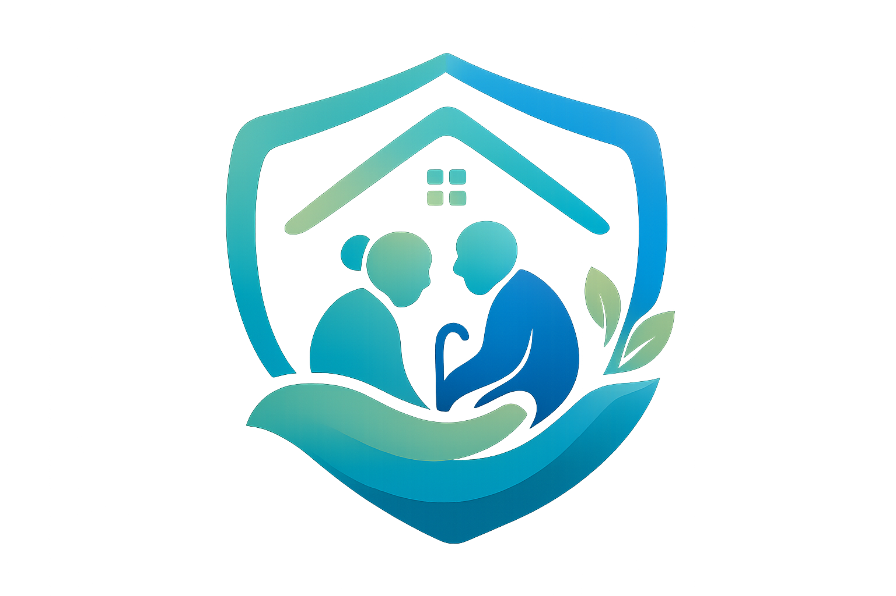

  
  <h1>Eldora</h1>
  
<strong>BINUS - BM Team</strong>

  
Protect. Respond. Recover

   

---

## 🚀 About Us

ELDORA is a healthcare technology initiative focused on building a privacy-first elderly safety and recovery ecosystem designed specifically for ASEAN aging populations.

Our mission is to help elderly individuals:
stay safe,
stay connected,
and stay supported
through AI-assisted technologies that are realistic, affordable, and human-centered.

---

## 👥 Team

We are BM Team from BINUS University Indonesia joined for Passage to ASEAN Hackathon 2026

<ul>
<li>Stanley Nathanael Wijaya - Team Lead</li>
<li>Lutfi Alvaro Pratama - IoT Engineer</li>
<li>Andrian Pratama - Mobile Developer</li>
<li>Khalisa Amanda Sifa Ghaizani - Backend Developer</li>
<li>Devon Nicholas - AI Engineer</li>
</ul>

---

## 📧 Contact

If you have any questions or would like to collaborate, please contact us using one of the following details:

- Email : stanley.n.wijaya7@gmail.com
- Telegram : https://t.me/xstynwx
- Discord : stynw7

---

   Made with 🤍 by BINUS BM Team 🔥

